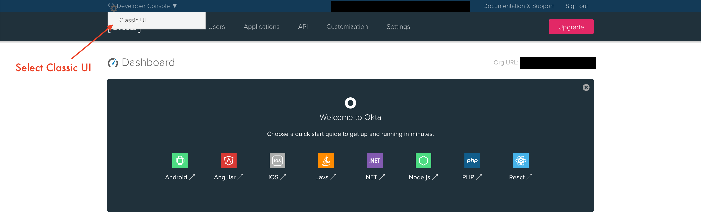

# Integrating IdP Sign In with Cognito

## Overview

This walkthrough will help guide you through creating a working Okta Application in order to successfully run the demo. 

## Okta Directory and Application Setup

#### If you already have a developer account with Okta, please skip to Step 3

1. Sign up for a developer account on [Okta](https://developer.okta.com/) using your corporate credentials.
2. Activate your account and sign into your Okta domain *stated in the email*.
3. Go to the Admin dashboard by clicking on the **Admin** button on the top-right corner of the page.
4. In the Admin dashboard, go to the top-left of the page where it says **Developer Console** and change it to **Classic UI**.

5. On the right-hand side of the page, under **Shortcuts**, click **Add Applications**.

6. Select **Create New App** from the left side of the page.

7. For Platform, select **Web** and enable **SAML 2.0** for the Sign in method. Then, press **Create**.

8. Give the app a name and a logo (*optional*), then select **Next**.

9. The next page describes the SAML settings for your app.
10. The **Single sign on URL** will be your Cognito user pool App Integration domain with */saml2/idpresponse* appended.
   * In Cognito, select **Manage User Pools** and then select the user pool for your application
   * On the left side, go to **App integration** and copy the domain
   * Example: *https://yourDomainPrefix.auth.yourRegion.amazoncognito.com/saml2/idpresponse*
11. Make sure the **Use this for Recipient URL and Destination URL** box is checked.
12. For the **Audience URI (SP Entity ID)**, enter the urn for your Cognito user pool, which is of the form *urn:amazon:cognito:sp:`<yourUserPoolID>`*.
    * The user pool ID can be found at the top of the **General Settings** page in your Cognito user pool, and the full urn is printed by the `deploy.sh` script after `Audience URI (SP Entity ID):`
13. Leave the **Default RelayState** blank.
14. Select *unspecified* for **Name ID format**.
15. Select *Okta username* for **Application username**.
16. Under **Attribute Statements**, configure the following:

    Name | Name format | Value
    :---: | :---: | :---:
    email | Unspecified | user.email
    firstName | Unspecified | user.firstName
    lastName | Unspecified | user.lastName

17. Under Group Attribute Statements, add the following:

    Name | Name format | Filter | value
    :---: | :---: | :---: | :---:
    groups | Unspecified | Starts with | pet-app

18. Click **Next**.
19. Select *I'm an Okta customer adding an internal app* for **Are you a customer or partner?**.
20. Select *This is an internal app that we have created* for **App Type**.

21. Click **Finish**.

